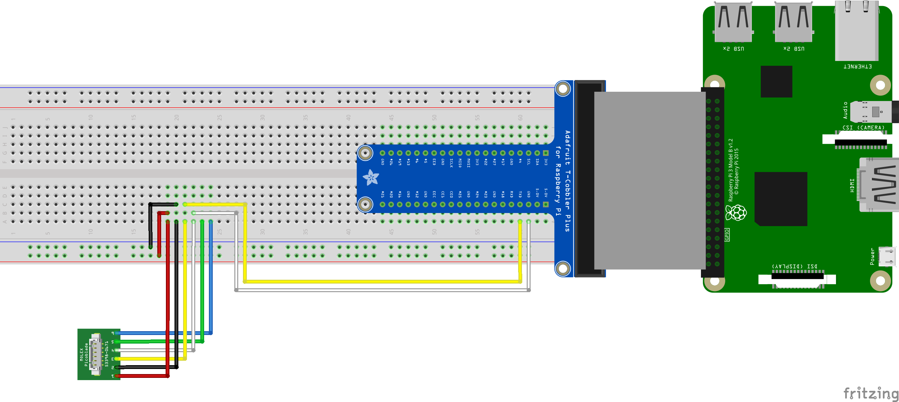

Fingerprint Module driver for Android Things [](https://developer.android.com/things/preview/releases.html#preview-6-1)
==================================================

An Android Things library for Fingerprint scanners R300 series (R301T as reference) and ZFM-20 series

| Module | Status      | 
| ------ | :---------: |
| R300   | Not Tested  |
| R301   | Not Tested  |
| R301T  | Working     |
| R302   | Not Tested  |
| R303   | Not Tested  |
| R303T  | Not Tested  |
| R306   | Not Tested  |
| R307   | Not Tested  |
| R308   | Not Tested  |
| R309   | Not Tested  |

Based on [Adafruit-Fingerprint-Sensor-Library](https://github.com/adafruit/Adafruit-Fingerprint-Sensor-Library) by **Adafruit**

### Features
- [x] Writing packet to module
- [x] Receiving packets from module
- [x] Verify password
- [x] Set password
- [x] Set Module address
- [ ] Set module system’s basic parameter
- [ ] Port Control
- [ ] Read system Parameter
- [ ] Read valid template number
- [ ] To collect finger image
- [ ] Upload image
- [ ] Download the image
- [ ] To generate character file from image
- [ ] To generate template
- [ ] To upload character or template
- [ ] To store template
- [ ] To read template from Flash library
- [ ] To delete template
- [ ] To empty finger library
- [ ] To carry out precise matching of two finger templates
- [ ] To search finger library
- [ ] To generate a random code
- [ ] To write note pad
- [ ] To read note pad

How to use the driver
---------------------

### Gradle dependency

To use the `r301t` driver, simply add the line below to your project's `build.gradle`, where `<version>` matches the last version of the driver available on maven central.
```groovy
dependencies {
    compile 'space.huttka.androidthings.driver:r300:<version>'
}
```
### Hardware Setup

The connections vary based on the [board](https://developer.android.com/things/hardware/index.html) used.

#### Raspberry Pi 3


| R30X Pin   | RPi Pin name | RPi Pin number               |
| ---------- | ------------ | ---------------------------- |
| 5V         | 5V           | 2, 4                         |
| GND        | GND          | 6, 9, 14, 20, 25, 30, 34, 39 |
| TXD        | RXD, GPIO15  | 8                            |
| RXD        | TXD, GPIO14  | 10                           |
| TOUCH      | Not Used Yet | --                           |
| TouchPower | Not Used Yet | --                           |

### Fetching finger image
```java
    R300Driver r300Driver = new R300Driver("UART0");
    
    // todo here...
```

Resources
---------

* [R301T product data sheet](assets/R301T%20fingerprint%20module%20user%20manual.pdf)
* [R300 series vendor data sheets](https://www.dropbox.com/sh/orprmb3bgb6lqb6/AACpiIXOF91R7-RQ9OkD4JXha?dl=0)
* [ZFM-20 series data sheet](https://cdn-shop.adafruit.com/datasheets/ZFM+user+manualV15.pdf)

License
-------

    MIT License

    Copyright (c) 2018 Huttka Labs

    Permission is hereby granted, free of charge, to any person obtaining a copy
    of this software and associated documentation files (the "Software"), to deal
    in the Software without restriction, including without limitation the rights
    to use, copy, modify, merge, publish, distribute, sublicense, and/or sell
    copies of the Software, and to permit persons to whom the Software is
    furnished to do so, subject to the following conditions:

    The above copyright notice and this permission notice shall be included in all
    copies or substantial portions of the Software.

    THE SOFTWARE IS PROVIDED "AS IS", WITHOUT WARRANTY OF ANY KIND, EXPRESS OR
    IMPLIED, INCLUDING BUT NOT LIMITED TO THE WARRANTIES OF MERCHANTABILITY,
    FITNESS FOR A PARTICULAR PURPOSE AND NONINFRINGEMENT. IN NO EVENT SHALL THE
    AUTHORS OR COPYRIGHT HOLDERS BE LIABLE FOR ANY CLAIM, DAMAGES OR OTHER
    LIABILITY, WHETHER IN AN ACTION OF CONTRACT, TORT OR OTHERWISE, ARISING FROM,
    OUT OF OR IN CONNECTION WITH THE SOFTWARE OR THE USE OR OTHER DEALINGS IN THE
    SOFTWARE.

Maintained by
-------------
[](http://huttka.space)